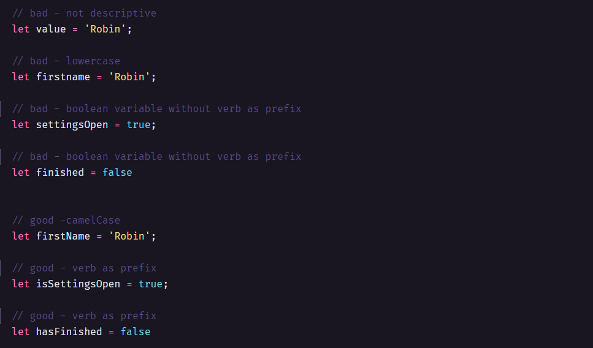
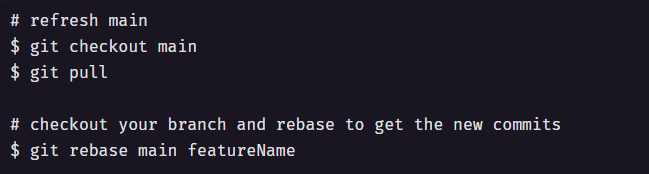
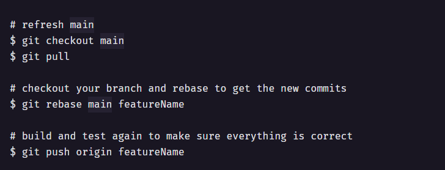
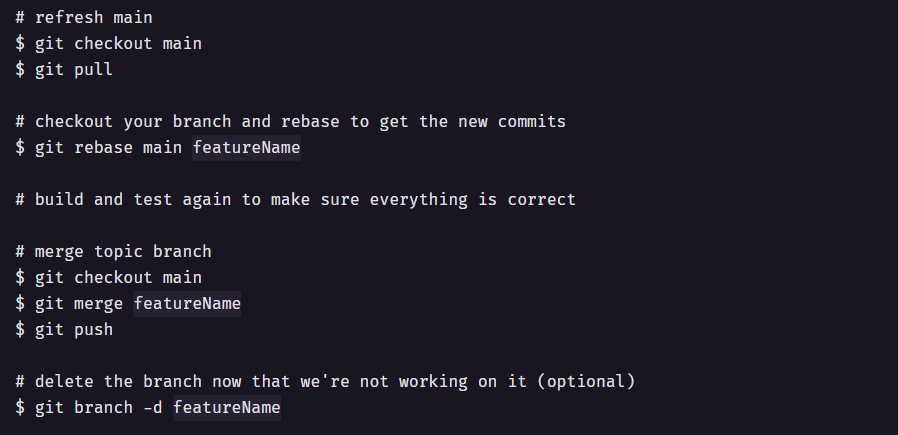
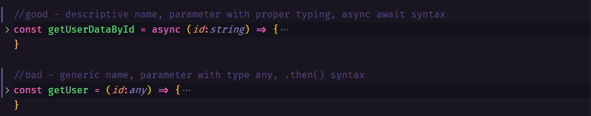
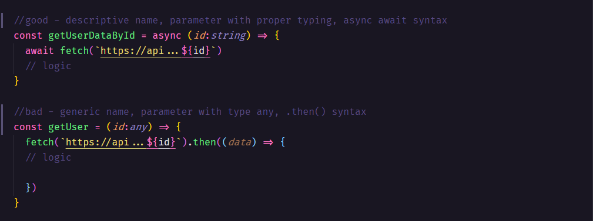
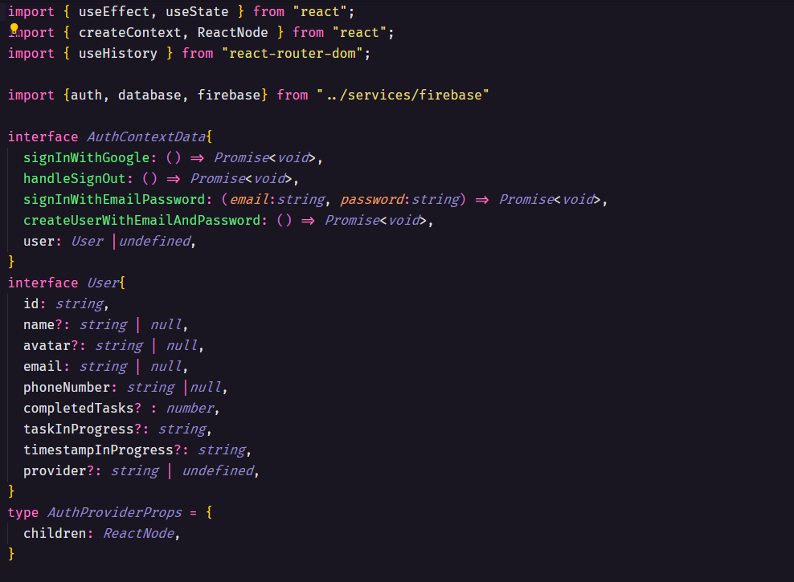

# kampanos-coding-guidelines

## Readable Code

Here are the basics core fundamentals for creating a readable code.
JavaScript coding guidelines

https://developer.mozilla.org/en-US/docs/MDN/Guidelines/Code_guidelines/JavaScript

Typescript coding guidelines
https://www.itwinjs.org/learning/guidelines/typescript-coding-guidelines/

### Variables

All variables must be camelCase and self-descriptive. It shouldn't be necessary to add a comment for additional documentation to the variable.  Boolean variables should have a verb as prefix:

  

Global Variables
•	A global JavaScript/Typescript variable is declared at the top of a project/file.
•	A global JavaScript/Typescript variable is written in camelCase if it is mutable.
•	A global JavaScript/Typescript variable is written in UPPERCASE if it is immutable.

  

  

  

  

  

  

  

