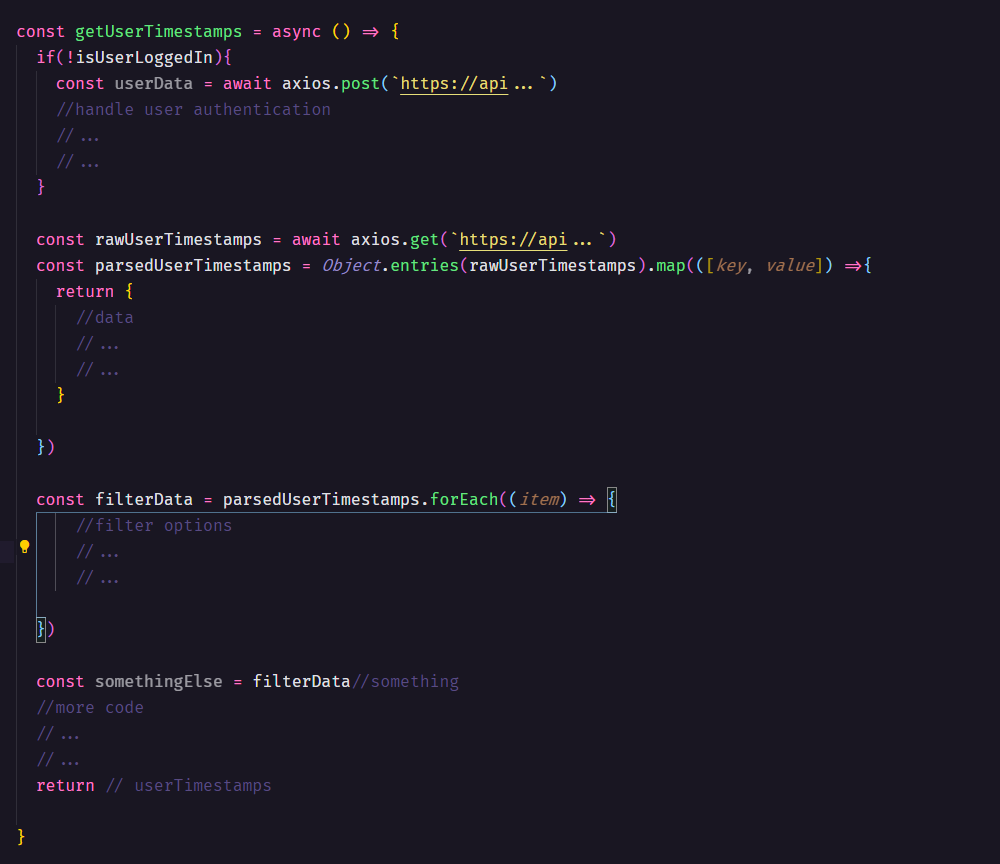

# kampanos-coding-guidelines

<p align="center">
  <a href="#Readable-Code">Readable Code</a>&nbsp;&nbsp;&nbsp;|&nbsp;&nbsp;&nbsp;
  <a href="#Single Responsibility Principle">Single Responsibility Principle</a>&nbsp;&nbsp;&nbsp;|&nbsp;&nbsp;&nbsp;
  <a href="#Testing">Testing</a>&nbsp;&nbsp;&nbsp;|&nbsp;&nbsp;&nbsp;
  <a href="#Typing">Typing</a>&nbsp;&nbsp;&nbsp;|&nbsp;&nbsp;&nbsp;
  <a href="#GIT">GIT</a>
</p>

## Readable Code

Here are the basics core fundamentals for creating a readable code.
JavaScript coding guidelines

https://developer.mozilla.org/en-US/docs/MDN/Guidelines/Code_guidelines/JavaScript

Typescript coding guidelines
https://www.itwinjs.org/learning/guidelines/typescript-coding-guidelines/


### Variables
<p>
All variables must be camelCase and self-descriptive. It shouldn't be necessary to add a comment for additional documentation to the variable.  Boolean variables should have a verb as prefix:
</p>
<p>
  
</p>

**Global Variables**
  
* A global JavaScript/Typescript variable is declared at the top of a project/file.
* A global JavaScript/Typescript variable is written in camelCase if it is mutable.
* A global JavaScript/Typescript variable is written in UPPERCASE if it is immutable.


### Functions
Like variables functions must be descriptive and should always have a verb as prefix:
* getSomething()
*	saveSomething()
*	handleSomething()

Use "async" "await", instead of “. then()” syntax whenever it's possible to make the code more readable.

<p>
  
</p>

This way it's easier to know the function purpose and also identify promises.

<p>
  
</p>


## Single Responsibility Principle

A class, a component or a function should have only __one__ responsibility.
</br>
Entities that have more than one responsibility should be split into different independent entities.
</br>
Independent and isolated entities its easier for:

*	Code reusability
*	Refactoring
*	New implementations
*	Automated tests
*	Less bugs/easier to isolate and fix bugs

### Wrong approach
In the code below the getUserTimestamps() function has too many responsabilities.
<p>
  
</p>

### Right approach
<p>
  
</p>

## Dependency Inversion Principle

 (DIP) is one of SOLID’s principles, which satisfies the following:
*	the upper levels modules do not depend on implementations of the lower levels’ ones. Modules should depend on abstractions;
*	abstractions do not depend on the details, but the details depend on abstractions;

<p>
  
</p>

As you can notice, the __*createCore()*__  function doesn’t need to know the details about how __*createDatabaseConnection()*__ and __*createWebserver()*__  works. The only thing that our main function needs to know is the available public methods from each function.
<p>
If any of the modules needs to change dependencies it shouldn’t affect any entities using that module.
</p>
<p>
  
</p>

Since the solution is split into different entities, we can reutilize them as submodules in different solutions.

## Testing

 ### Dependency injection and unit Test
In order completely isolate entities from its dependencies we need to perform a __*dependency injection*__ with mock data during unit testing
For that we set a new parameter called *configurations* with an empty object as default value. 

<p>
  
</p>
In this example, since we encapsulated the "*database*" and "*webserver*" It's easier to replace them with a mock version.
If no data is provided when calling this function, It will behave naturally, using the dependencies instead.

/////////////////////////////////////////
### more info about testing and jest
/////////////////////////////////////////

## Typing

Type definitions should be declared at top of a file, after imports.

<p>
  
</p>

All variables, methods and functions should be properly declared with their respective type. Variables with type “*any*” should be avoided, and type “*null*” should be only used when it’s specified by external dependency/API.

////////////////////////////
#### More info about Typing
////////////////////////////


## GIT

__The ``“main”`` branch its only used as integration.__
When working on a feature never do it in the main branch directly. Instead create a new branch based on the “main”: 

```
$ git checkout -b featureName main
```

This creates a branch called ``“featureName”`` which sprouts from the ``"main"`` branch, and checks it out automatically. 
In this branch, apply all the commits you want. You can periodically ensure that it is off the latest main by doing: 

```
# refresh main
$ git checkout main
$ git pull

# checkout your branch and rebase to get the new commits
$ git rebase main featureName
```

When the new feature is finish but still need discussion/review, push the local branch into a remote branch with the following commands then perform a __Pull Request__ on Github.

```
# refresh main
$ git checkout main
$ git pull
 
# checkout your branch and rebase to get the new commits
$ git rebase main featureName
 
# build and test again to make sure everything is correct
$ git push origin featureName
```

If the implementation needs no further discussion/review, merge the branches locally and then push code to remote repository.

```
# refresh main
$ git checkout main
$ git pull
 
# checkout your branch and rebase to get the new commits
$ git rebase main featureName
 
# build and test again to make sure everything is correct

# merge topic branch
$ git checkout main
$ git merge featureName
$ git push
 
# delete the branch now that we're not working on it (optional)
$ git branch -d featureName
```
If ``git push`` fails, it’s because your master is not up to date. Refresh it with ``git pull --rebase``, and then try ``git push`` again.
With this workflow the main branch is always clean just updated with the latest commits.

